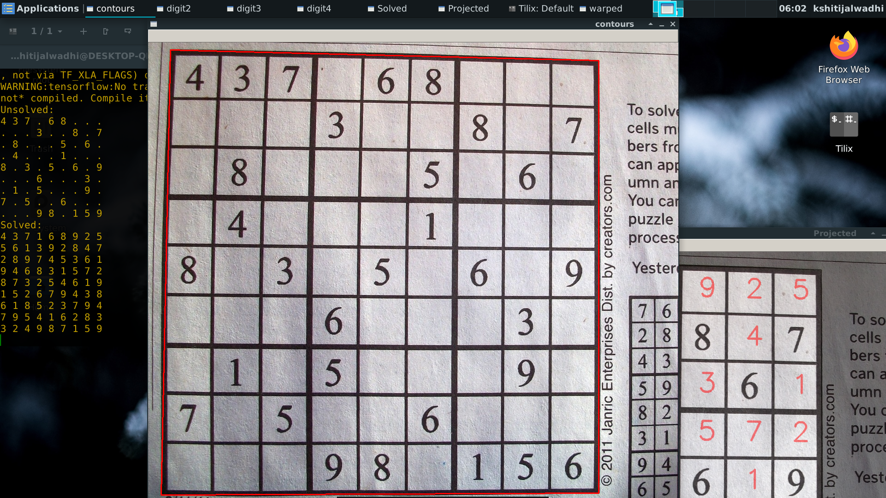
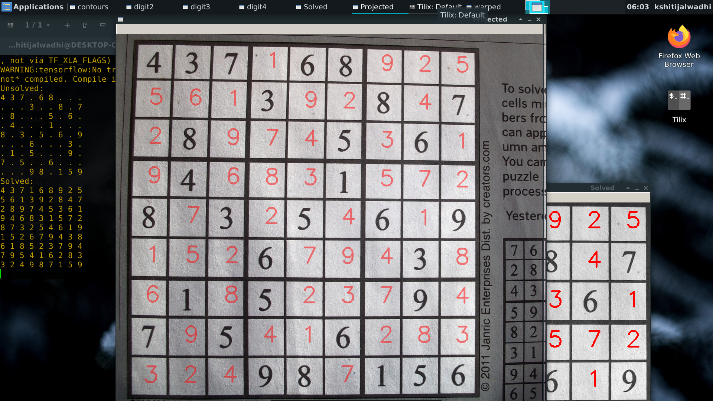

# SudokuSolver

- [ ] Work in progress..

Implemented a Sudoku solver using python and openCV.
Used MNIST handwritten data to train a neural network to predict digits.

---
## Steps:

1. Preprocess the image:
   
   1. Apply Gaussian blur
   2. Apply adaptive threshold
   3. Warped the image
   
2. Used contours to find the grid
3. Used window sliding technique to pick the image in each block. 
4. Used the trained model to predict the digit and stored it in an array.
5. Solved the sudoku using CP techniques.

---
## Screenshots:
### Largest Countour:

### Solved:

--- 

## Scope of improvement:

Work more on pre-processing of image to make even less clearer sudoku pics work fine. For now, there might be some issues in reading low quality pics.